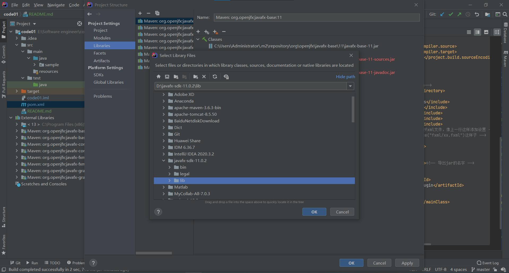

# Digital-Gym-System
## 安装步骤
### 使用maven
1. 下载maven
2. 新建pom.xml文件
3. 修改文件为
```xml
<?xml version="1.0" encoding="UTF-8"?>
<project xmlns="http://maven.apache.org/POM/4.0.0"
         xmlns:xsi="http://www.w3.org/2001/XMLSchema-instance"
         xsi:schemaLocation="http://maven.apache.org/POM/4.0.0 http://maven.apache.org/xsd/maven-4.0.0.xsd">
    <modelVersion>4.0.0</modelVersion>

    <groupId>{self info}</groupId>
    <artifactId>{self info}</artifactId>
    <version>1.0-SNAPSHOT</version>
    <packaging>jar</packaging>

    <dependencies>
        <dependency>
            <groupId>org.openjfx</groupId>
            <artifactId>javafx-controls</artifactId>
            <version>11</version>
        </dependency>
        <dependency>
            <groupId>org.openjfx</groupId>
            <artifactId>javafx-fxml</artifactId>
            <version>11</version>
        </dependency>
    </dependencies>
    <properties>
        <maven.compiler.source>13</maven.compiler.source>
        <maven.compiler.target>13</maven.compiler.target>
<!--        要改成utf-8否则不支持中文-->
        <project.build.sourceEncoding>UTF-8</project.build.sourceEncoding>
    </properties>
    <build>
        <resources>
            <resource>
                <!-- 这里是放在 src/main/java-->
                <directory>src/main/java</directory>
                <includes>
                    <include>**/*.properties</include>
                    <include>**/fxml/*.fxml</include>
                    <include>**/css/*.css</include>
                    <include>**/pic/*.jpg</include>
                    <include>**/pic/*.png</include>
                    <!-- 如果想要弄个包名专门放fxml文件，像上一行这样添加设置 -->
                    <!-- 之后，使用getResource("fxml/xx.fxml")这样子 -->
                </includes>
                <filtering>false</filtering>
            </resource>
        </resources>
        <finalName>testMaven.jar</finalName><!-- 导出jar的名字 -->
        <plugins>
            <plugin>
                <groupId>org.openjfx</groupId>
                <artifactId>javafx-maven-plugin</artifactId>
                <version>0.0.1</version>
                <configuration>
                    <mainClass>sample.Main</mainClass>
                </configuration>
            </plugin>

        </plugins>
    </build>
</project>
```
4. 在控制台（或者idee的maven插件里面运行mvn javafx:run的命令
### 使用sdk模式运行javafx程序
1. 下载javafx sdk（在javafx-sdk分支）
2. 在idea的project structure内的libraries中添加javafx sdk的lib文件夹

3. 直接运行main函数
